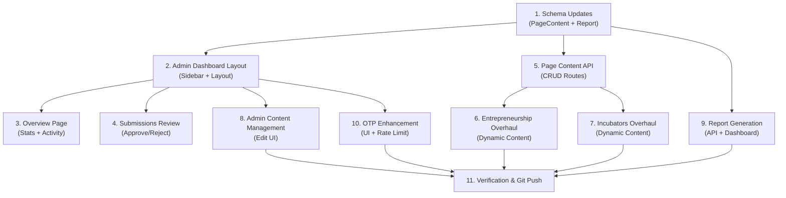

# Project Tasks Roadmap

**Center for Leadership and Business Incubators - Misrata**

---

## Table of Contents

1. [Task 1: Finalize Email System Templates](#task-1-finalize-email-system-templates)
2. [Task 2: Redesign Innovators & Creators Feature](#task-2-redesign-innovators--creators-feature)
3. [Task 3: Send Notification Messages to System Administrators](#task-3-send-notification-messages-to-system-administrators)
4. [Task 4: Design and Develop Dashboard for Managers and Supervisors](#task-4-design-and-develop-dashboard-for-managers-and-supervisors)
5. [Task 5: Improve and Standardize Button Designs](#task-5-improve-and-standardize-button-designs)
6. [Task 6: Improve Card Layouts](#task-6-improve-card-layouts)
7. [Task 7: Integrate Email & WhatsApp for Registration Workflows](#task-7-integrate-email--whatsapp-for-registration-workflows)
8. [Task 8: Standardize File Naming Convention](#task-8-standardize-file-naming-convention)
9. [Task 9: Build WhatsApp Integration System](#task-9-build-whatsapp-integration-system)
10. [Task 10: Navigation Improvements](#task-10-navigation-improvements)
11. [Task 11: News Section UI Enhancements](#task-11-news-section-ui-enhancements)
12. [Task 12: Fix Registration Form Data Persistence](#task-12-fix-registration-form-data-persistence)
13. [Task 13: AI-Powered Form Redesign](#task-13-ai-powered-form-redesign)
14. [Task 14: News Data Verification & Schema Alignment](#task-14-news-data-verification--schema-alignment)
15. [Task 15: Project Cleanup & Component Unification](#task-15-project-cleanup--component-unification)
16. [Task 16: Remove Mock Data & Verify Data Connections](#task-16-remove-mock-data--verify-data-connections)
17. [Task 17: Enhanced Card Design & Detail Pages](#task-17-enhanced-card-design--detail-pages)
18. [Task 18: Manager & Supervisor Control Panel Implementation](#task-18-manager--supervisor-control-panel-implementation)
19. [Task 19: Project Cleanup & Component Unification](#task-19-project-cleanup--component-unification)
20. [Task 20: Docker Containerization](#task-20-docker-containerization)
21. [Task 21: Remove Mock Data & Verify Data Connections](#task-21-remove-mock-data--verify-data-connections)
22. [Task 22: Home Section Design & Development](#task-22-home-section-design--development)
23. [Task 23: Leadership & Incubators Content Strategy](#task-23-leadership--incubators-content-strategy)
24. [Task 24: Contact Us Page Content Implementation](#task-24-contact-us-page-content-implementation)
25. [Task 25: Architectural Debt Elimination & System Hardening](#task-25-architectural-debt-elimination--system-hardening)
26. [Task 26: Redis Caching Implementation](#task-26-redis-caching-implementation)
27. [Phase 2: Admin Dashboard, OTP Authentication & Content Page Improvements](#phase-2-admin-dashboard-otp-authentication--content-page-improvements-implemented)

---

## Overview

This document outlines the development tasks for enhancing the Center for Leadership and Business Incubators - Misrata platform. The tasks are organized by priority and include detailed subtasks, technical requirements, and acceptance criteria.

**Tech Stack Reference (v2.0):**

- Frontend: Next.js 16, React 19, TypeScript, Tailwind CSS
- Backend: Hono.js, Prisma ORM
- Database: MySQL 8.0 (production), MariaDB (legacy)
- Storage: AWS S3 / Cloudflare R2 / MinIO
- Email: Nodemailer, React Email
- Authentication: NextAuth.js v5

---

## Task 1: Finalize Email System Templates

### Status: ✅ Completed

### Description

Complete and customize the existing email system templates to ensure they are production-ready with proper branding, bilingual support, and all necessary workflows.

### Current State

- ✅ Basic email infrastructure exists (`src/features/email/`)
- ✅ Email documentation available (`docs/email/`)
- ✅ Nodemailer and React Email configured
- ✅ Database models: `EmailLog`, `EmailQueue`, `EmailTemplate` (check schema)

### Subtasks

#### 1.1 Review and Test Existing Templates

- [ ] Review email templates in `src/lib/email/templates/` (if they exist)
- [ ] Test submission confirmation templates (English/Arabic)
- [ ] Test status update templates (approval/rejection)
- [ ] Test 2FA templates
- [ ] Verify RTL support for Arabic templates
- [ ] Test email rendering on multiple clients (Gmail, Outlook, mobile)

#### 1.2 Customize Templates for Branding

- [ ] Add EBIC logo and college branding to all templates
- [ ] Apply consistent color scheme (primary: orange, matching website)
- [ ] Add footer with contact information and social links
- [ ] Implement responsive design for mobile devices
- [ ] Add unsubscribe/preferences link (if applicable)

#### 1.3 Create Additional Templates

- [ ] Welcome email for new users
- [ ] Password reset email template
- [ ] Account verification email
- [ ] Weekly digest/newsletter template (optional)
- [ ] Admin notification templates

#### 1.4 Template Content Enhancement

- [ ] Improve copywriting for all templates (professional tone)
- [ ] Add clear call-to-action buttons
- [ ] Include estimated response times
- [ ] Add helpful links and resources
- [ ] Implement personalization tokens (name, company, etc.)

#### 1.5 Testing and Validation

- [ ] Run test-email-service.ts script
- [ ] Verify SMTP connection with Gmail
- [ ] Test email delivery to multiple providers
- [ ] Check spam score using mail-tester.com
- [ ] Verify database logging in `EmailLog` table

### Technical Requirements

- React Email components (`@react-email/components`)
- Handlebars for dynamic content
- Bilingual support (Arabic RTL, English LTR)
- Mobile-responsive design
- Accessibility (ARIA labels, alt text)

### Files to Modify/Create

- `src/lib/email/templates/` (all template files)
- `src/app/admin/settings/email-templates/` (Handlebars templates)
- `docs/email/templates.md` (documentation)

### Acceptance Criteria

- [ ] All templates render correctly in email preview
- [ ] Arabic templates display properly with RTL layout
- [ ] Emails pass spam filter tests
- [ ] Templates are consistent with website branding
- [ ] All dynamic content renders correctly
- [ ] Email logs are created in database

---

## Task 2: Redesign Innovators & Creators Feature

### Status: ✅ Completed

### Priority: 🔴 HIGH

### Description

Redesign and enhance the Innovators & Creators feature to include additional required fields and support for multiple project file uploads. This task involves database schema changes, form redesign, file upload functionality, and backend API updates.

### Current State

- ✅ Basic Innovator model exists with: name, email, phone, projectTitle, projectDescription, objective, stageDevelopment
- ✅ Registration form implemented (`innovators-registration-form.tsx`)
- ✅ Single image upload supported via `imageId`
- ✅ Location, specialization fields implemented
- ✅ Multiple project file upload support (PDF, Word, JPG, PNG, etc.)

### Required New Fields

1. **Location** - Innovator's geographical location (string)
2. **Specialization** - Area of expertise/industry sector (string)
3. **Project Files** - Multiple file uploads (documents, images, presentations)

### Subtasks

#### 2.1 Database Schema Updates

- [x] Update `Innovator` model in `prisma/schema.prisma`:

  ```prisma
  model Innovator {
    id                 String                @id @default(cuid())
    name               String
    imageId            String?
    email              String
    phone              String
    location           String                // NEW: Geographical location
    specialization     String                // NEW: Area of expertise
    projectTitle       String
    projectDescription String?
    objective          String?
    stageDevelopment   StageDevelopment
    status             RecordStatus          @default(PENDING)
    isVisible          Boolean               @default(false)
    createdAt          DateTime              @default(now())
    updatedAt          DateTime              @updatedAt
    emailLogs          EmailLog[]            @relation("InnovatorEmails")
    projectFiles       InnovatorProjectFile[] // NEW: Multiple file uploads

    @@index([email])
    @@index([status])
    @@index([specialization])
  }
  ```

- [ ] Create new `InnovatorProjectFile` model:

  ```prisma
  model InnovatorProjectFile {
    id           String     @id @default(cuid())
    innovatorId  String
    innovator    Innovator  @relation(fields: [innovatorId], references: [id], onDelete: Cascade)
    fileName     String
    fileType     String     // MIME type (application/pdf, image/jpeg, etc.)
    fileSize     Int        // Size in bytes
    mediaId      String     // Reference to Media table for file storage
    description  String?    // Optional file description
    createdAt    DateTime   @default(now())
    updatedAt    DateTime   @updatedAt

    @@index([innovatorId])
    @@index([fileType])
  }
  ```

- [ ] Run Prisma migration:
  ```bash
  npx prisma migrate dev --name add_innovator_fields_and_files
  ```

#### 2.2 Update Validation Schemas

- [x] Update `src/features/innovators/schemas.ts`:

  ```typescript
  export const createCreativeRegistrationSchema = (
    t: (key: string) => string,
  ) => {
    return z.object({
      // ====== Basic information ======
      name: z.string().min(1, { message: t('RequiredField') }),
      phoneNumber: z
        .string()
        .min(1, { message: t('RequiredField') })
        .refine(
          (phone) =>
            typeof phone === 'string' && /^\+[\d\s-]{6,15}$/.test(phone),
          { message: t('InvalidPhoneNumber') },
        ),
      email: z
        .string()
        .min(1, { message: t('RequiredField') })
        .email({ message: t('InvalidEmail') }),
      location: z.string().min(1, { message: t('RequiredField') }), // NEW
      specialization: z.string().min(1, { message: t('RequiredField') }), // NEW
      image: z
        .union([
          z.instanceof(File),
          z.string().transform((value) => (value === '' ? undefined : value)),
        ])
        .optional(),

      // ======= Project Details ======
      projectTitle: z.string().min(1, { message: t('RequiredField') }),
      projectDescription: z
        .string()
        .min(1, { message: t('RequiredField') })
        .max(1000, { message: `${t('MaximumFieldSize')} 1000` }),
      objective: z.string().optional(),
      stageDevelopment: z.nativeEnum(StageDevelopment).optional(),

      // ======= Project Files ======= NEW
      projectFiles: z
        .array(z.instanceof(File))
        .min(0)
        .max(10, { message: t('MaximumFiles') })
        .refine(
          (files) => {
            const maxSize = 10 * 1024 * 1024; // 10MB per file
            return files.every((file) => file.size <= maxSize);
          },
          { message: t('FileTooLarge') },
        )
        .refine(
          (files) => {
            const allowedTypes = [
              'application/pdf',
              'application/msword',
              'application/vnd.openxmlformats-officedocument.wordprocessingml.document',
              'image/jpeg',
              'image/jpg',
              'image/png',
              'application/vnd.ms-powerpoint',
              'application/vnd.openxmlformats-officedocument.presentationml.presentation',
            ];
            return files.every((file) => allowedTypes.includes(file.type));
          },
          { message: t('InvalidFileType') },
        )
        .optional(),

      // ======== Center Policies ========
      TermsOfUse: z
        .boolean()
        .default(false)
        .refine((value) => value === true, {
          message: t('TermsOfUse'),
        }),
    });
  };
  ```

#### 2.3 Update Registration Form Component

- [x] Update `src/features/innovators/components/innovators-registration-form.tsx`:
  - [x] Add Location input field
  - [x] Add Specialization input field (consider dropdown/select with predefined options)
  - [x] Add Project Files upload section with drag-and-drop
  - [x] Display file list with remove option
  - [x] Show file upload progress
  - [x] Validate file types and sizes client-side
  - [x] Update form layout to accommodate new fields

- [x] Add multi-file upload UI:

  ```typescript
  const [projectFiles, setProjectFiles] = useState<File[]>([]);

  const handleFileChange = (e: React.ChangeEvent<HTMLInputElement>) => {
    const files = Array.from(e.target.files || []);
    setProjectFiles((prev) => [...prev, ...files].slice(0, 10)); // Max 10 files
    form.setValue('projectFiles', [...projectFiles, ...files].slice(0, 10));
  };

  const removeFile = (index: number) => {
    const updated = projectFiles.filter((_, i) => i !== index);
    setProjectFiles(updated);
    form.setValue('projectFiles', updated);
  };
  ```

#### 2.4 Update API Endpoints

- [x] Update `src/features/innovators/server/*.ts` or API route:
  - [x] Handle new location and specialization fields
  - [x] Process multiple file uploads
  - [x] Store files in Media table
  - [x] Create InnovatorProjectFile records
  - [x] Validate file types server-side
  - [x] Handle file size limits

- [x] File upload handler example:

  ```typescript
  // Process project files
  if (projectFiles && projectFiles.length > 0) {
    for (const file of projectFiles) {
      // Convert file to buffer
      const buffer = await file.arrayBuffer();

      // Store in Media table
      const media = await db.media.create({
        data: {
          data: Buffer.from(buffer),
          type: file.type,
          size: file.size,
        },
      });

      // Create InnovatorProjectFile record
      await db.innovatorProjectFile.create({
        data: {
          innovatorId: innovator.id,
          fileName: file.name,
          fileType: file.type,
          fileSize: file.size,
          mediaId: media.id,
        },
      });
    }
  }
  ```

#### 2.5 Update Card Component

- [x] Update `src/features/innovators/components/card-innovators.tsx`:
  - [x] Display location with icon
  - [x] Display specialization badge
  - [x] Add file count indicator
  - [x] Update card layout for new fields

#### 2.6 Add Specialization Options

- [x] Create specialization constants in `src/features/innovators/constants.ts`:
  ```typescript
  export const Specializations = {
    TECHNOLOGY: { ar: 'التكنولوجيا', en: 'Technology' },
    HEALTHCARE: { ar: 'الرعاية الصحية', en: 'Healthcare' },
    EDUCATION: { ar: 'التعليم', en: 'Education' },
    AGRICULTURE: { ar: 'الزراعة', en: 'Agriculture' },
    MANUFACTURING: { ar: 'التصنيع', en: 'Manufacturing' },
    SERVICES: { ar: 'الخدمات', en: 'Services' },
    ENERGY: { ar: 'الطاقة', en: 'Energy' },
    ENVIRONMENT: { ar: 'البيئة', en: 'Environment' },
    FINANCE: { ar: 'المالية', en: 'Finance' },
    OTHER: { ar: 'أخرى', en: 'Other' },
  };
  ```

#### 2.7 Add Translations

- [x] Update locale files (`messages/ar.json`, `messages/en.json`):
  ```json
  {
    "CreatorsAndInnovators": {
      "form": {
        "location": "Location / الموقع",
        "specialization": "Specialization / التخصص",
        "projectFiles": "Project Files / ملفات المشروع",
        "uploadFiles": "Upload Files / تحميل الملفات",
        "maxFiles": "Maximum 10 files / حد أقصى 10 ملفات",
        "allowedTypes": "Allowed: PDF, Word, JPG, PNG, PPT / مسموح: PDF, Word, JPG, PNG, PPT",
        "fileTooLarge": "File size must not exceed 10MB / حجم الملف يجب ألا يتجاوز 10 ميجابايت",
        "invalidFileType": "Invalid file type / نوع ملف غير صالح",
        "maxFilesReached": "Maximum files reached / تم الوصول للحد الأقصى من الملفات"
      }
    }
  }
  ```

#### 2.8 Admin Dashboard Updates

- [x] Update admin innovators list to show new fields
- [x] Add file download functionality in admin view
- [x] Add file preview modal (for images/PDFs)
- [x] Update filter options to include location and specialization

#### 2.9 Testing

- [x] Test form validation with new fields
- [x] Test file upload (single and multiple files)
- [x] Test file type validation
- [x] Test file size validation
- [x] Test with different file types (PDF, DOCX, images)
- [x] Test file removal functionality
- [x] Test database migrations
- [x] Test API endpoints with new fields
- [x] Test bilingual support for new fields
- [x] Test admin dashboard file viewing

### Technical Requirements

- Next.js file upload handling (FormData)
- React Dropzone for drag-and-drop (already installed)
- File type validation (file-type package - already installed)
- Prisma migrations
- Media storage in database (LongBlob)

### Files to Modify/Create

- `prisma/schema.prisma` - Update Innovator model, create InnovatorProjectFile model
- `src/features/innovators/schemas.ts` - Add new field validations
- `src/features/innovators/components/innovators-registration-form.tsx` - Add fields and file upload UI
- `src/features/innovators/components/card-innovators.tsx` - Display new fields
- `src/features/innovators/constants.ts` - Add specialization options
- `src/features/innovators/server/*.ts` - Update API to handle files
- `messages/ar.json`, `messages/en.json` - Add translations
- `src/app/admin/innovators/*` - Update admin views

### File Upload UI Mockup

```
┌─────────────────────────────────────────┐
│ Project Files                           │
│                                         │
│ ┌───────────────────────────────────┐   │
│ │ 📎 Drag & Drop files here         │   │
│ │     or click to browse            │   │
│ │                                   │   │
│ │  Allowed: PDF, Word, JPG, PNG, PPT│   │
│ │  Max: 10 files, 10MB each         │   │
│ └───────────────────────────────────┘   │
│                                         │
│ Uploaded Files:                         │
│ [ ] proposal.pdf (2.5 MB)      [X]      │
│ [ ] design.jpg (1.2 MB)        [X]      │
│ [ ] budget.xlsx (500 KB)       [X]      │
│                                         │
│ 3 of 10 files uploaded                  │
└─────────────────────────────────────────┘
```

### Acceptance Criteria

- [x] Location field is required and validated
- [x] Specialization field is required with predefined options
- [x] Multiple files can be uploaded (up to 10 files)
- [x] Only allowed file types are accepted (PDF, Word, JPG, PNG, PPT)
- [x] File size validation (max 10MB per file)
- [x] Files are stored securely in database
- [x] Files can be downloaded from admin dashboard
- [x] Form validation works for all new fields
- [x] Bilingual support for all new fields
- [x] Database migrations run successfully
- [x] Existing innovator records remain intact
- [x] Admin can view and manage files
- [x] File upload progress is displayed
- [x] Files can be removed before submission

### Time Estimate

**12-16 hours**

- Database schema (2 hours)
- Form updates (3-4 hours)
- File upload functionality (4-5 hours)
- API updates (2-3 hours)
- Admin dashboard updates (2 hours)
- Testing (2-3 hours)

---

## Task 3: Send Notification Messages to System Administrators

### Status: ✅ Completed (Feb 9, 2026)

### Description

Implement a comprehensive notification system to alert system administrators when critical events occur, such as new registrations, submissions, or system errors. Notifications will be sent via email and eventually WhatsApp (once Task 8 is complete).

### Current State

- ✅ Email infrastructure exists (`src/lib/email/service.ts`)
- ✅ Admin user model with RBAC permissions
- ✅ EmailLog and EmailQueue models in database
- ❌ No automated admin notifications currently

### Subtasks

#### 2.1 Define Notification Events

- [x] New collaborator registration
- [x] New innovator registration
- [x] Submission status changes
- [x] System errors or failures
- [x] User account activities (new admin users, role changes)
- [x] Database backup completion
- [x] Security alerts (failed login attempts, suspicious activity)

#### 2.2 Create Admin Notification Service

- [x] Create `src/lib/notifications/admin-notifications.ts`
- [x] Implement `notifyAdmins(event, data)` function
- [x] Query database for admins with notification permissions
- [x] Support filtering by permission type (e.g., only notify users with "collaborators:manage")
- [x] Queue notifications for all eligible admins

#### 2.3 Email Templates for Admin Notifications

- [x] New registration alert template (AR/EN)
- [x] Submission review reminder template (AR/EN)
- [x] System error alert template (AR/EN)
- [x] Security alert template (AR/EN)
- [x] Daily/Weekly digest template (AR/EN)
- [x] Include direct links to admin dashboard actions

#### 2.4 Admin Notification Preferences

- [x] Add notification preferences to User model
  ```prisma
  model User {
    // ... existing fields
    notificationPreferences Json? // { emailNewSubmissions: true, emailSystemErrors: true, etc. }
  }
  ```
- [x] Create admin settings page for notification preferences
- [x] Allow admins to enable/disable specific notification types
- [x] Add option for digest mode (immediate vs. daily summary)

#### 2.5 Integration Points

- [x] Trigger notification on new collaborator registration (`/api/collaborator` route)
- [x] Trigger notification on new innovator registration (`/api/innovators` route)
- [x] Trigger notification on system errors (error handlers)
- [x] Add admin notification to approval/rejection workflows
- [x] Create scheduled job for daily/weekly digests

#### 2.6 Admin Dashboard Notifications Panel

- [x] Create notification bell icon in admin header
- [x] Display unread notification count
- [x] Create notification dropdown/panel
- [x] Mark notifications as read
- [x] Link notifications to relevant pages
- [x] Store notifications in database for history

#### 2.7 Database Schema Updates

- [x] Create `AdminNotification` model

  ```prisma
  model AdminNotification {
    id          String   @id @default(cuid())
    userId      String
    user        User     @relation(fields: [userId], references: [id])
    type        String   // "NEW_REGISTRATION", "SYSTEM_ERROR", etc.
    title       String
    message     String   @db.Text
    data        Json?    // Additional data for the notification
    isRead      Boolean  @default(false)
    readAt      DateTime?
    actionUrl   String?  // Direct link to take action
    createdAt   DateTime @default(now())
    updatedAt   DateTime @updatedAt

    @@index([userId, isRead])
    @@index([createdAt])
  }
  ```

- [x] Run Prisma migration

#### 2.8 Testing

- [x] Test notification triggers for each event type
- [x] Test admin preference filtering
- [x] Test email delivery to multiple admins
- [x] Test notification panel UI in dashboard
- [x] Test mark as read functionality
- [x] Test digest mode

### Technical Requirements

- Existing email service (`src/lib/email/service.ts`)
- BullMQ for scheduled jobs (already configured)
- Prisma ORM for database operations
- Next.js API routes for webhook endpoints
- React Query for real-time notification updates

### Files to Create/Modify

- `src/lib/notifications/admin-notifications.ts` (new)
- `src/lib/email/templates/admin/` (new directory)
- `src/app/admin/notifications/page.tsx` (new)
- `src/app/admin/settings/notifications/page.tsx` (new)
- `src/features/admin/components/NotificationBell.tsx` (new)
- `src/features/collaborators/server/route.ts` (modify)
- `src/features/innovators/server/route.ts` (modify)
- `prisma/schema.prisma` (add AdminNotification model)

### Acceptance Criteria

- [x] Admins receive email notifications for new registrations
- [x] Admins receive notifications for system errors
- [x] Notification preferences can be customized per admin
- [x] Notification panel shows recent alerts in dashboard
- [x] Notifications include actionable links to relevant pages
- [x] Both Arabic and English templates work correctly
- [x] Notifications are logged in database
- [x] Read/unread status is tracked properly

---

## Task 4: Design and Develop Dashboard for Managers and Supervisors

### Status: ✅ Completed (Phase 1 Refactor)

### Description

Create a dedicated dashboard interface for managers and supervisors (non-technical admin users) that provides an intuitive overview of key metrics, pending actions, and simplified controls for common tasks.

### Current State

- ✅ RBAC system exists with Role and Permission models
- ✅ Basic admin dashboard exists (`/admin/dashboard`)
- ❌ Current dashboard is developer-focused, not manager-friendly
- ❌ No role-specific dashboard views

### Subtasks

#### 3.1 Requirements & Design

- [ ] Conduct user research with managers/supervisors
- [ ] Define key metrics managers need to see
- [ ] Create wireframes for manager dashboard
- [ ] Design mobile-responsive layouts
- [ ] Get stakeholder approval on designs

#### 3.2 Dashboard Layout Structure

- [ ] Create manager-specific dashboard route (`/admin/manager-dashboard`)
- [ ] Design header with quick actions
- [ ] Create sidebar with simplified navigation
- [ ] Implement responsive grid layout for widgets
- [ ] Add customizable widget arrangement

#### 3.3 Key Metrics Widgets

- [ ] **Pending Reviews Widget**
  - Count of pending collaborator submissions
  - Count of pending innovator submissions
  - Quick links to review pages
- [ ] **Recent Activity Widget**
  - Timeline of recent registrations
  - Recent approvals/rejections
  - System activity log
- [ ] **Statistics Widget**
  - Total collaborators (approved/pending/rejected)
  - Total innovators (approved/pending/rejected)
  - Charts showing trends over time
- [ ] **Quick Actions Widget**
  - Review pending submissions
  - Manage users
  - View reports
  - System settings

#### 3.4 Data Visualization

- [ ] Install charting library (Chart.js or Recharts)
- [ ] Create line chart for registration trends
- [ ] Create pie chart for submission statuses
- [ ] Create bar chart for monthly/weekly comparisons
- [ ] Add date range filters for charts
- [ ] Export charts as images/PDFs

#### 3.5 Simplified Review Interface

- [ ] Create card-based review interface
- [ ] One-click approve/reject buttons
- [ ] Inline view of submission details
- [ ] Bulk actions (approve/reject multiple)
- [ ] Add comment/reason field for rejections
- [ ] Show submission history

#### 3.6 Reporting Features

- [ ] Generate monthly summary reports
- [ ] Export data to Excel/CSV
- [ ] Create printable report templates
- [ ] Schedule automated report emails
- [ ] Custom date range reports

#### 3.7 Role-Based Dashboard Routing

- [ ] Detect user role on login
- [ ] Redirect managers to manager dashboard
- [ ] Redirect developers/admins to technical dashboard
- [ ] Add dashboard preference in user settings
- [ ] Allow users to switch between dashboard views

#### 3.8 Mobile Optimization

- [ ] Optimize dashboard for tablet devices
- [ ] Create mobile-specific widget layouts
- [ ] Implement touch-friendly controls
- [ ] Test on various mobile devices
- [ ] Add pull-to-refresh functionality

#### 3.9 Notifications Integration

- [ ] Display notification count on dashboard
- [ ] Show recent notifications widget
- [ ] Highlight urgent/high-priority items
- [ ] Add notification sound toggle
- [ ] Implement desktop push notifications (optional)

#### 3.10 Performance Optimization

- [ ] Implement data caching for metrics
- [ ] Add skeleton loaders for widgets
- [ ] Lazy load heavy components
- [ ] Optimize database queries
- [ ] Add pagination for large datasets

### Dashboard Permissions

Create new permission resources:

- `dashboard:manager:view` - View manager dashboard
- `dashboard:manager:customize` - Customize widget layout
- `submissions:review` - Review and approve/reject submissions
- `reports:generate` - Generate and export reports

### Technical Requirements

- Next.js App Router for dashboard pages
- TanStack Query for data fetching
- Recharts or Chart.js for visualizations
- Tailwind CSS for styling
- Framer Motion for animations (already installed)
- React Hook Form for forms (already installed)

### Files to Create

- `src/app/admin/manager-dashboard/page.tsx` (main dashboard)
- `src/features/admin/components/ManagerDashboard/` (component directory)
  - `MetricsWidget.tsx`
  - `PendingReviewsWidget.tsx`
  - `RecentActivityWidget.tsx`
  - `StatisticsWidget.tsx`
  - `QuickActionsWidget.tsx`
  - `ChartWidget.tsx`
- `src/features/admin/api/use-dashboard-metrics.ts` (data fetching)
- `src/app/api/admin/metrics/route.ts` (API endpoint)
- `src/features/admin/components/ReviewInterface/` (review components)
- `src/features/admin/components/Reports/` (reporting components)

### Acceptance Criteria

- [ ] Manager dashboard is accessible at `/admin/manager-dashboard`
- [ ] Dashboard displays real-time metrics accurately
- [ ] Charts and visualizations render correctly
- [ ] Review interface allows quick approve/reject actions
- [ ] Dashboard is responsive on mobile and tablet
- [ ] Managers can customize widget layout
- [ ] Role-based routing works correctly
- [ ] Dashboard loads in under 2 seconds
- [ ] Reports can be generated and exported
- [ ] All text supports Arabic and English

---

## Task 5: Improve and Standardize Button Designs

### Status: ✅ Completed

### Description

Standardize button designs across the entire platform while giving send buttons a distinctive look. Create a consistent design system for all interactive elements.

### Current State

- ✅ Existing button components:
  - `src/components/buttons/SubmitButton.tsx`
  - `src/components/buttons/ActiveButton.tsx`
  - `src/components/buttons/TranslateButton.tsx`
  - `src/components/ui/button.tsx`

### Subtasks

#### 3.1 Audit Current Buttons

- [ ] List all button usage across the platform
- [ ] Document current button styles and variants
- [ ] Identify inconsistencies in design
- [ ] Screenshot all button types for reference

#### 3.2 Design System Planning

- [ ] Define button hierarchy (primary, secondary, tertiary)
- [ ] Define button states (default, hover, active, disabled, loading)
- [ ] Define button sizes (sm, md, lg, xl)
- [ ] Define special buttons (send, delete, cancel)
- [ ] Create color palette for buttons
- [ ] Design focus states for accessibility

#### 3.3 Create Base Button Component

- [ ] Refactor `src/components/ui/button.tsx` with variants
- [ ] Implement CVA (class-variance-authority) for variants
- [ ] Add proper TypeScript types
- [ ] Support all HTML button attributes
- [ ] Add loading state with spinner
- [ ] Add icon support (left/right)

#### 3.4 Create Specialized Buttons

- [ ] **SubmitButton** (send buttons with distinctive design)
  - Enhance animation for loading state
  - Add distinctive gradient or glow effect
  - Implement success animation
- [ ] **PrimaryButton** (main actions)
- [ ] **SecondaryButton** (secondary actions)
- [ ] **OutlineButton** (tertiary actions)
- [ ] **DangerButton** (delete, reject actions)
- [ ] **IconButton** (icon-only buttons)
- [ ] **LinkButton** (button styled as link)

#### 3.5 Send Button Distinctive Design

- [ ] Create unique visual style for send buttons
- [ ] Add animation on click (paper plane flying, etc.)
- [ ] Add success feedback animation
- [ ] Implement distinctive hover effects
- [ ] Add sound effect (optional)
- [ ] Test on all forms (contact, registration, etc.)

#### 3.6 Implement Across Platform

---

## Task 9: Build WhatsApp Integration System

### Status: 🔴 Not Started

### Description

Build a notification system similar to the email system but using WhatsApp for instant messaging. This will provide an alternative communication channel for users who prefer WhatsApp.

### Architecture Overview

```
┌─────────────────┐
│ User Action     │
│ (Registration)  │
└────────┬────────┘
         │
         ▼
┌─────────────────────────────────┐
│ RPC Handler                     │
│ - Creates EmailQueue record     │
│ - Creates WhatsAppQueue record  │
└────────┬────────────────────────┘
         │
    ┌────┴────┐
    ▼         ▼
┌────────┐ ┌──────────────┐
│ Email  │ │ WhatsApp     │
│ Worker │ │ Worker       │
└────────┘ └──────────────┘
```

### Subtasks

#### 2.1 Research and Setup

- [ ] Choose WhatsApp Business API provider (Twilio, Meta Cloud API, or others)
- [ ] Create WhatsApp Business account
- [ ] Obtain API credentials and phone number
- [ ] Test API connection and message sending
- [ ] Review rate limits and pricing

#### 2.2 Database Schema

- [ ] Create `WhatsAppQueue` model in Prisma schema
  ```prisma
  model WhatsAppQueue {
    id          String      @id @default(cuid())
    to          String      // Phone number in E.164 format
    message     String      @db.Text
    templateId  String?
    status      QueueStatus @default(PENDING)
    messageId   String?
    errorMessage String?
    sentAt      DateTime?
    createdAt   DateTime    @default(now())
    updatedAt   DateTime    @updatedAt
  }
  ```
- [ ] Create `WhatsAppLog` model for tracking
- [ ] Create `WhatsAppTemplate` model for message templates
- [ ] Run Prisma migration

#### 2.3 WhatsApp Service Layer

- [ ] Create `src/lib/whatsapp/service.ts` (main service)
- [ ] Create `src/lib/whatsapp/client.ts` (API client wrapper)
- [ ] Implement `sendMessage(to, message)` function
- [ ] Implement `sendTemplate(to, templateId, params)` function
- [ ] Add phone number validation (libphonenumber-js)
- [ ] Add error handling and retry logic

#### 2.4 Message Templates

- [ ] Create submission confirmation template (Arabic/English)
- [ ] Create approval notification template
- [ ] Create rejection notification template
- [ ] Create reminder template
- [ ] Test templates with WhatsApp Business API

#### 2.5 Queue Worker

- [ ] Create `services/whatsapp-worker/worker.ts`
- [ ] Implement BullMQ queue processing
- [ ] Add row locking to prevent duplicate sends
- [ ] Implement retry logic (3 attempts)
- [ ] Log all sends to `WhatsAppLog` table
- [ ] Add worker script to package.json: `worker:whatsapp`

#### 2.6 RPC Integration

- [ ] Create `src/lib/whatsapp/rpc/sendMessage.ts`
- [ ] Register WhatsApp methods in RPC registry
- [ ] Add validation with Zod schemas
- [ ] Test RPC endpoint: `/api/rpc`

#### 2.7 Testing

- [ ] Unit tests for WhatsApp service
- [ ] Integration tests for queue worker
- [ ] E2E test for registration workflow
- [ ] Test with real phone numbers
- [ ] Test rate limiting

### Technical Requirements

- WhatsApp Business API (Twilio or Meta)
- Phone number validation (libphonenumber-js - already installed)
- BullMQ queue (already configured)
- Prisma ORM for database

### Environment Variables

```env
WHATSAPP_API_KEY="your-api-key"
WHATSAPP_PHONE_NUMBER="+1234567890"
WHATSAPP_API_PROVIDER="twilio" # or "meta"
WHATSAPP_WEBHOOK_URL="https://yourdomain.com/api/whatsapp/webhook"
```

### Files to Create

- `src/lib/whatsapp/service.ts`
- `src/lib/whatsapp/client.ts`
- `src/lib/whatsapp/templates/`
- `src/lib/whatsapp/rpc/sendMessage.ts`
- `services/whatsapp-worker/worker.ts`
- `services/whatsapp-worker/config.ts`
- `tests/whatsapp/` (all test files)
- `docs/whatsapp/README.md`

### Acceptance Criteria

- [ ] WhatsApp messages send successfully via API
- [ ] Messages are queued and processed by worker
- [ ] Templates support both Arabic and English
- [ ] Phone numbers are validated before sending
- [ ] All sends are logged to database
- [ ] Error handling works correctly
- [ ] RPC endpoint accepts WhatsApp requests

---

### Status: 🔴 Not Started

### Description

Standardize button designs across the entire platform while giving send buttons a distinctive look. Create a consistent design system for all interactive elements.

### Current State

- ✅ Existing button components:
  - `src/components/buttons/SubmitButton.tsx`
  - `src/components/buttons/ActiveButton.tsx`
  - `src/components/buttons/TranslateButton.tsx`
  - `src/components/ui/button.tsx`

### Subtasks

#### 3.1 Audit Current Buttons

- [ ] List all button usage across the platform
- [ ] Document current button styles and variants
- [ ] Identify inconsistencies in design
- [ ] Screenshot all button types for reference

#### 3.2 Design System Planning

- [ ] Define button hierarchy (primary, secondary, tertiary)
- [ ] Define button states (default, hover, active, disabled, loading)
- [ ] Define button sizes (sm, md, lg, xl)
- [ ] Define special buttons (send, delete, cancel)
- [ ] Create color palette for buttons
- [ ] Design focus states for accessibility

#### 3.3 Create Base Button Component

- [ ] Refactor `src/components/ui/button.tsx` with variants
- [ ] Implement CVA (class-variance-authority) for variants
- [ ] Add proper TypeScript types
- [ ] Support all HTML button attributes
- [ ] Add loading state with spinner
- [ ] Add icon support (left/right)

#### 3.4 Create Specialized Buttons

- [ ] **SubmitButton** (send buttons with distinctive design)
  - Enhance animation for loading state
  - Add distinctive gradient or glow effect
  - Implement success animation
- [ ] **PrimaryButton** (main actions)
- [ ] **SecondaryButton** (secondary actions)
- [ ] **OutlineButton** (tertiary actions)
- [ ] **DangerButton** (delete, reject actions)
- [ ] **IconButton** (icon-only buttons)
- [ ] **LinkButton** (button styled as link)

#### 3.5 Send Button Distinctive Design

- [ ] Create unique visual style for send buttons
- [ ] Add animation on click (paper plane flying, etc.)
- [ ] Add success feedback animation
- [ ] Implement distinctive hover effects
- [ ] Add sound effect (optional)
- [ ] Test on all forms (contact, registration, etc.)

#### 3.6 Implement Across Platform

- [ ] Replace buttons in forms
- [ ] Replace buttons in modals/dialogs
- [ ] Replace buttons in admin dashboard
- [ ] Replace buttons in navigation
- [ ] Update all feature components

#### 3.7 Documentation

- [ ] Create Storybook stories for all button variants
- [ ] Document usage in component library
- [ ] Add examples and best practices
- [ ] Create visual design guide

### Technical Requirements

- class-variance-authority (CVA) - already installed
- Tailwind CSS for styling
- Framer Motion for animations - already installed
- Lucide React for icons - already installed

### Button Variants Structure

```typescript
const buttonVariants = cva('base-button-classes', {
  variants: {
    variant: {
      primary: '...',
      secondary: '...',
      outline: '...',
      danger: '...',
      ghost: '...',
      link: '...',
      send: '...', // Distinctive style
    },
    size: {
      sm: '...',
      md: '...',
      lg: '...',
      xl: '...',
    },
  },
  defaultVariants: {
    variant: 'primary',
    size: 'md',
  },
});
```

### Files to Modify/Create

- `src/components/ui/button.tsx` (main button component)
- `src/components/buttons/SubmitButton.tsx` (refactor)
- `src/components/buttons/index.ts` (barrel export)
- `docs/components/buttons.md` (documentation)
- All feature components using buttons

### Acceptance Criteria

- [ ] All buttons use consistent design system
- [ ] Send buttons have distinctive, attractive design
- [ ] Buttons are accessible (keyboard, screen readers)
- [ ] Loading states work correctly
- [ ] Hover and focus states are clear
- [ ] Buttons are responsive on mobile
- [ ] Documentation is complete

---

## Task 6: Improve Card Layouts

### Status: ✅ Completed

### Description

Enhance the design and layout of various card components used throughout the application (e.g., entity cards, news cards, partner cards) to improve readability, visual appeal, and responsiveness.

### Current State

- ✅ Shared card components implemented (`src/components/ui/card.tsx`)
- ✅ Innovator cards redesigned with modern layout
- ✅ Collaborator cards updated to show key information
- ✅ News cards enhanced with better typography and image handling
- ✅ Hover effects and animations added

### Subtasks

#### 4.1 Analyze Data Requirements

- [x] Review `Collaborator` model in Prisma schema
  - Related: ExperienceProvidedMedia, MachineryAndEquipmentMedia
- [x] Review `Innovator` model in Prisma schema
  - Fields: name, email, phone, projectTitle, description, objective, stageDevelopment, image
- [x] Identify required vs optional fields
- [x] Determine display priority of fields

#### 4.2 Design CardCompanies Component

- [x] Audit current implementation
- [x] Fix FIXME comments in existing code
- [x] Design new layout for company information
- [x] Add support for all database fields:
  - [x] Company logo/image display
  - [x] Company name (prominent)
  - [x] Industrial sector badge
  - [x] Specialization tags
  - [x] Experience provided summary
  - [x] Machinery and equipment summary
  - [x] Contact information (phone, email, website)
  - [x] Location (with icon)
  - [x] Media gallery preview
- [x] Implement hover effects
- [x] Add responsive design (mobile, tablet, desktop)

#### 4.3 Design card-innovators Component (From Scratch)

- [x] Create complete component structure
- [x] Design card layout for innovator information:
  - [x] Innovator photo/avatar
  - [x] Name (prominent)
  - [x] Project title
  - [x] Project description (truncated with "read more")
  - [x] Project objective
  - [x] Development stage badge
  - [x] Contact information
  - [x] Project status indicator
- [x] Add card actions (view details, contact)
- [x] Implement hover and focus states
- [x] Add loading skeleton state
- [x] Implement responsive design

#### 4.4 Shared Card Features

- [x] Create base card component (`src/components/ui/card.tsx`)
- [x] Implement card variants (collaborator, innovator, news, etc.)
- [x] Add image optimization with Next.js Image
- [x] Add lazy loading for images
- [x] Add badge component for statuses
- [x] Add tag component for specializations/sectors
- [x] Create media gallery modal for multiple images

#### 4.5 Implement Gallery Support

- [ ] Create thumbnail grid
- [ ] Add lightbox for full-screen view
- [ ] Support video media (if applicable)

#### 4.6 Accessibility & UX

- [ ] Add proper ARIA labels
- [ ] Implement keyboard navigation
- [ ] Add focus indicators
- [ ] Test with screen readers
- [ ] Add loading states
- [ ] Add error states (broken images, missing data)
- [ ] Implement placeholder for missing images

#### 4.7 Integration with Data Fetching

- [ ] Update API routes to return complete data
- [ ] Add data validation with Zod
- [ ] Implement proper error handling
- [ ] Add pagination support for card lists
- [ ] Add filtering and sorting options

### Database Fields Mapping

#### Collaborator Card Fields

```typescript
interface CollaboratorCardProps {
  id: string;
  companyName: string;
  primaryPhoneNumber: string;
  optionalPhoneNumber?: string;
  email: string;
  location?: string;
  site?: string;
  industrialSector: string;
  specialization: string;
  experienceProvided?: string;
  machineryAndEquipment?: string;
  imageId?: string;
  experienceProvidedMedia: Media[];
  machineryAndEquipmentMedia: Media[];
  status: RecordStatus;
  isVisible: boolean;
}
```

#### Innovator Card Fields

```typescript
interface InnovatorCardProps {
  id: string;
  name: string;
  imageId?: string;
  email: string;
  phone: string;
  projectTitle: string;
  projectDescription?: string;
  objective?: string;
  stageDevelopment: StageDevelopment;
  status: RecordStatus;
  isVisible: boolean;
}
```

### Design Specifications

- Card width: Flexible with max-width constraints
- Card height: Auto, maintaining aspect ratio
- Border radius: 16px (rounded-2xl)
- Shadow: Elevated shadow on hover
- Spacing: Consistent padding (16px/24px)
- Typography: Clear hierarchy with din-bold/din-regular fonts

### Files to Modify/Create

- `src/features/collaborators/components/CardCompanies.tsx` (refactor)
- `src/features/innovators/components/card-innovators.tsx` (implement)
- `src/components/ui/card.tsx` (base component)
- `src/components/ui/badge.tsx` (status badges)
- `src/components/ui/tag.tsx` (category tags)
- `src/components/ui/gallery-modal.tsx` (media gallery)
- `src/features/collaborators/api/` (data fetching)
- `src/features/innovators/api/` (data fetching)

### Acceptance Criteria

- [ ] CardCompanies accurately displays all database fields
- [ ] card-innovators is fully implemented and functional
- [ ] Cards are responsive on all screen sizes
- [ ] Images load with proper optimization
- [ ] Media galleries work correctly
- [ ] Cards are accessible (WCAG 2.1 AA)
- [ ] Loading and error states are implemented
- [ ] Cards work with RTL (Arabic) layout
- [ ] Hover effects are smooth and performant

---

## Task 7: Integrate Email & WhatsApp for Registration Workflows

### Status: 🔴 Not Started

### Description

Integrate both email and WhatsApp notification systems into the registration, acceptance, and rejection workflows for collaborators and innovators.

### Workflow Overview

```
User Submits Registration
         │
         ▼
    Save to Database
    (status: PENDING)
         │
         ▼
    Send Confirmation
    ┌────┴────┐
    ▼         ▼
  Email    WhatsApp
  Queued    Queued
    │         │
    ▼         ▼
  Sent      Sent
         │
         ▼
    Admin Reviews
         │
    ┌────┴────┐
    ▼         ▼
Approve    Reject
    │         │
    ▼         ▼
Send Status Update
    ┌────┴────┐
    ▼         ▼
  Email    WhatsApp
```

### Subtasks

#### 5.1 Registration Workflow Integration

##### 5.1.1 Collaborator Registration

- [ ] Update registration API endpoint
- [ ] Add dual notification trigger on submission
- [ ] Create confirmation email template
- [ ] Create confirmation WhatsApp template
- [ ] Queue both notifications
- [ ] Store notification IDs in database
- [ ] Add UI feedback for successful submission

##### 5.1.2 Innovator Registration

- [ ] Update registration API endpoint
- [ ] Add dual notification trigger on submission
- [ ] Create confirmation email template
- [ ] Create confirmation WhatsApp template
- [ ] Queue both notifications
- [ ] Store notification IDs in database
- [ ] Add UI feedback for successful submission

#### 5.2 Admin Approval/Rejection Workflow

##### 5.2.1 Admin Dashboard Integration

- [ ] Add approval action to admin dashboard
- [ ] Add rejection action with reason field
- [ ] Update status in database
- [ ] Trigger status update notifications
- [ ] Display notification status in admin UI

##### 5.2.2 Approval Notifications

- [ ] Create approval email template (bilingual)
- [ ] Create approval WhatsApp template (bilingual)
- [ ] Include next steps in notification
- [ ] Add welcome information
- [ ] Include contact details for questions

##### 5.2.3 Rejection Notifications

- [ ] Create rejection email template (bilingual)
- [ ] Create rejection WhatsApp template (bilingual)
- [ ] Include rejection reason (if provided)
- [ ] Offer improvement suggestions
- [ ] Include reapplication information

#### 5.3 Notification Preferences

- [ ] Add user preference model to database
  ```prisma
  model NotificationPreference {
    id              String  @id @default(cuid())
    email           String  @unique
    emailEnabled    Boolean @default(true)
    whatsappEnabled Boolean @default(true)
    phoneNumber     String?
    createdAt       DateTime @default(now())
    updatedAt       DateTime @updatedAt
  }
  ```
- [ ] Add preference selection in registration form
- [ ] Respect user preferences when sending notifications
- [ ] Add preference management UI

#### 5.4 Notification Tracking

- [ ] Link notifications to user records
- [ ] Track delivery status (sent, delivered, failed)
- [ ] Track read receipts (if available)
- [ ] Create notification history view in admin
- [ ] Add retry mechanism for failed notifications

#### 5.5 Edge Cases & Error Handling

- [ ] Handle invalid email addresses
- [ ] Handle invalid phone numbers
- [ ] Handle notification service outages
- [ ] Implement fallback notifications
- [ ] Add notification logs for debugging
- [ ] Handle rate limiting from providers

#### 5.6 Testing

- [ ] Test complete registration flow (both types)
- [ ] Test approval workflow with notifications
- [ ] Test rejection workflow with notifications
- [ ] Test with email only preference
- [ ] Test with WhatsApp only preference
- [ ] Test with both preferences
- [ ] Test error scenarios
- [ ] Load test with multiple simultaneous registrations

### Integration Points

#### API Endpoints to Modify

```typescript
// Collaborator registration
POST /api/collaborator/register
  -> Save to DB
  -> Queue email confirmation
  -> Queue WhatsApp confirmation

// Innovator registration
POST /api/innovators/register
  -> Save to DB
  -> Queue email confirmation
  -> Queue WhatsApp confirmation

// Admin actions
POST /api/admin/collaborator/approve/:id
  -> Update status to APPROVED
  -> Queue email notification
  -> Queue WhatsApp notification

POST /api/admin/collaborator/reject/:id
  -> Update status to REJECTED
  -> Queue email notification
  -> Queue WhatsApp notification

POST /api/admin/innovator/approve/:id
  -> Update status to APPROVED
  -> Queue email notification
  -> Queue WhatsApp notification

POST /api/admin/innovator/reject/:id
  -> Update status to REJECTED
  -> Queue email notification
  -> Queue WhatsApp notification
```

### Notification Templates Required

#### Email Templates

1. Collaborator confirmation (AR/EN)
2. Innovator confirmation (AR/EN)
3. Collaborator approval (AR/EN)
4. Innovator approval (AR/EN)
5. Collaborator rejection (AR/EN)
6. Innovator rejection (AR/EN)

#### WhatsApp Templates

1. Collaborator confirmation (AR/EN)
2. Innovator confirmation (AR/EN)
3. Collaborator approval (AR/EN)
4. Innovator approval (AR/EN)
5. Collaborator rejection (AR/EN)
6. Innovator rejection (AR/EN)

### Files to Modify/Create

- `src/features/collaborators/api/register.ts`
- `src/features/innovators/api/register.ts`
- `src/features/admin/api/approve.ts`
- `src/features/admin/api/reject.ts`
- `src/lib/notifications/service.ts` (unified notification service)
- `prisma/schema.prisma` (NotificationPreference model)
- All template files (email and WhatsApp)

### Acceptance Criteria

- [ ] Registration triggers both email and WhatsApp confirmations
- [ ] Approval sends notifications via both channels
- [ ] Rejection sends notifications via both channels
- [ ] User preferences are respected
- [ ] Notifications are logged and trackable
- [ ] Admin can view notification history
- [ ] Failed notifications are retried
- [ ] Both Arabic and English templates work correctly
- [ ] All edge cases are handled gracefully

---

## Task 8: Standardize File Naming Convention

### Status: 🔴 Not Started

### Description

Adopt a consistent file naming convention across the entire project, using either the kebab-case (CardCompanies) or lowercase-with-hyphens (card-innovators) style.

### Naming Convention Decision

After analyzing the existing codebase, the recommended convention is:

- **Components**: PascalCase for React components (e.g., `CardCompanies.tsx`, `SubmitButton.tsx`)
- **Utilities/Services**: kebab-case (e.g., `email-service.ts`, `auth-utils.ts`)
- **API Routes**: kebab-case (e.g., `send-email.ts`, `approve-collaborator.ts`)
- **Types**: PascalCase with `.types.ts` suffix (e.g., `Collaborator.types.ts`)

This aligns with Next.js conventions and React best practices.

### Subtasks

#### 6.1 Audit Current File Naming

- [ ] List all files in the project
- [ ] Categorize files by type (components, utils, API, etc.)
- [ ] Identify naming inconsistencies
- [ ] Create naming convention document

#### 6.2 Create Naming Convention Guide

- [ ] Document naming rules for each file type:
  - React components
  - Utility functions
  - API routes
  - Type definitions
  - Test files
  - Configuration files
  - Style files
- [ ] Provide examples for each category
- [ ] Document exceptions (if any)
- [ ] Add to project documentation

#### 6.3 Plan Refactoring Strategy

- [ ] Identify high-risk renames (frequently imported)
- [ ] Create rename script or checklist
- [ ] Determine order of renaming (dependencies first)
- [ ] Plan testing after each rename batch
- [ ] **POSTPONE** actual renaming for later phase

#### 6.4 Update Import Statements

- [ ] Use VSCode refactor tool for safe renames
- [ ] Update all import statements
- [ ] Update dynamic imports
- [ ] Update webpack/Next.js configs (if needed)
- [ ] Update test file imports

#### 6.5 Update Documentation

- [ ] Update README with naming convention
- [ ] Update CONTRIBUTING guide
- [ ] Update code review checklist
- [ ] Update onboarding documentation
- [ ] Add ESLint rules for naming (optional)

#### 6.6 Create Tracking List for Future Renames

- [ ] List files that need renaming
- [ ] Prioritize by impact (low risk first)
- [ ] Document dependencies for each file
- [ ] Create GitHub issues for each rename batch
- [ ] Schedule rename sprints

### Naming Convention Guidelines

#### React Components

```
✅ CardCompanies.tsx
✅ SubmitButton.tsx
✅ EmailTemplate.tsx
❌ card-companies.tsx
❌ submit-button.tsx
```

#### Utilities & Services

```
✅ email-service.ts
✅ auth-utils.ts
✅ format-date.ts
❌ emailService.ts
❌ authUtils.ts
```

#### API Routes (Hono/Next.js)

```
✅ send-email.ts
✅ approve-collaborator.ts
❌ sendEmail.ts
❌ approveCollaborator.ts
```

#### Type Definitions

```
✅ Collaborator.types.ts
✅ Email.types.ts
✅ User.types.ts
❌ collaborator.ts (ambiguous)
```

#### Test Files

```
✅ email-service.test.ts
✅ CardCompanies.test.tsx
✅ auth-utils.spec.ts
```

## Task 12: Fix Registration Form Data Persistence

### Status: ✅ Completed

### Priority: 🔴 HIGH

### Description

Ensure that registration form data persists across page reloads and browser sessions to prevent data loss for users filling out long forms.

### Current State

- ✅ `useLocalStorage` hook exists
- ✅ Form data layout implemented in `src/features/collaborators/registration/layout.tsx`
- ✅ Form persistence implemented and verified
- ✅ Data restoration on reload works correctly

### Subtasks

#### 6.1 Diagnosis

- [x] Investigate why `localStorage` data isn't being retrieved on reload
- [x] Check `useEffect` dependency arrays in registration layouts
- [x] Verify Zod schema validation isn't blocking initial data load
- [x] Debug `zustand` state hydration

#### 6.2 Implementation Fix

- [x] Implement robust state re-hydration in `src/features/collaborators/registration/layout.tsx`
- [x] Implement robust state re-hydration in `src/features/innovators/registration/layout.tsx`
- [x] Add auto-save debounce (500ms) to form inputs
- [x] Ensure "Save and Continue" explicitly commits to storage
- [x] Add "Clear Form" button for testing/resetting

#### 6.3 UX Improvements

- [x] Add visual indicator ("Draft saved")
- [x] Add prompt to resume previous session if data exists
- [x] Clear storage upon successful submission

#### 6.4 Testing

- [x] Test reload on each step of Collaborator form
- [x] Test reload on each step of Innovator form
- [x] Test browser closure and reopen
- [x] Verify data is cleared after successful submission

### Integration Tests

- Complete registration workflow
- Notification delivery (email + WhatsApp)
- Admin approval/rejection workflow
- Database operations

### E2E Tests

- User registration flow
- Admin dashboard actions
- Notification reception
- Multi-language support

### Testing Tools

- Jest (already configured)
- React Testing Library (already installed)
- Playwright (optional for E2E)

---

## Timeline Estimates

| Task                         | Estimated Time            | Priority |
| ---------------------------- | ------------------------- | -------- |
| Task 1: Email Templates      | 8-12 hours                | High     |
| Task 2: Admin Notifications  | 12-16 hours               | High     |
| Task 3: Manager Dashboard    | 24-32 hours               | High     |
| Task 4: Button Design        | 8-12 hours                | Medium   |
| Task 5: Card Layouts         | 12-16 hours               | High     |
| Task 6: Workflow Integration | 16-20 hours               | High     |
| Task 7: Naming Convention    | 4-6 hours (documentation) | Low      |
| Task 8: WhatsApp System      | 16-24 hours               | Medium   |

**Total Estimated Time**: 100-138 hours

---

## Success Metrics

### Functional Metrics

- [ ] All notifications (email + WhatsApp) delivered successfully
- [ ] Registration completion rate improved
- [ ] Admin workflow efficiency increased
- [ ] User satisfaction with notifications

### Technical Metrics

- [ ] Code coverage ≥ 80%
- [ ] All tests passing
- [ ] No console errors in production
- [ ] Lighthouse score ≥ 90

### UX Metrics

- [ ] Button click-through rate improved
- [ ] Card interaction increased
- [ ] Mobile responsiveness improved
- [ ] Accessibility score improved

---

## Risk Assessment

### High Risk

- WhatsApp API integration (depends on external provider)
- Database migrations (potential data loss)
- Breaking changes in file renaming

### Medium Risk

- Email deliverability (spam filters)
- Performance impact of notifications
- Template rendering issues

### Low Risk

- Button styling changes
- Card layout improvements
- Documentation updates

---

## Notes

- All tasks should maintain backward compatibility where possible
- Test thoroughly before deploying to production
- Document all API changes
- Keep bilingual support (Arabic/English) in mind for all user-facing features
- Follow existing code patterns and conventions
- Prioritize accessibility and mobile responsiveness

---

## Task 9: Build WhatsApp Integration System

### Status: 🔴 Not Started

### Description

Build a notification system similar to the email system but using WhatsApp for instant messaging. This will provide an alternative communication channel for users who prefer WhatsApp.

### Architecture Overview

```
┌─────────────────┐
│ User Action     │
│ (Registration)  │
└────────┬────────┘
         │
         ▼
┌─────────────────────────────────┐
│ RPC Handler                     │
│ - Creates EmailQueue record     │
│ - Creates WhatsAppQueue record  │
└────────┬────────────────────────┘
         │
    ┌────┴────┐
    ▼         ▼
┌────────┐ ┌──────────────┐
│ Email  │ │ WhatsApp     │
│ Worker │ │ Worker       │
└────────┘ └──────────────┘
```

### Subtasks

#### 8.1 Research and Setup

- [ ] Choose WhatsApp Business API provider (Twilio, Meta Cloud API, or others)
- [ ] Create WhatsApp Business account
- [ ] Obtain API credentials and phone number
- [ ] Test API connection and message sending
- [ ] Review rate limits and pricing

#### 8.2 Database Schema

- [ ] Create `WhatsAppQueue` model in Prisma schema
  ```prisma
  model WhatsAppQueue {
    id          String      @id @default(cuid())
    to          String      // Phone number in E.164 format
    message     String      @db.Text
    templateId  String?
    status      QueueStatus @default(PENDING)
    messageId   String?
    errorMessage String?
    sentAt      DateTime?
    createdAt   DateTime    @default(now())
    updatedAt   DateTime    @updatedAt
  }
  ```
- [ ] Create `WhatsAppLog` model for tracking
- [ ] Create `WhatsAppTemplate` model for message templates
- [ ] Run Prisma migration

#### 8.3 WhatsApp Service Layer

- [ ] Create `src/lib/whatsapp/service.ts` (main service)
- [ ] Create `src/lib/whatsapp/client.ts` (API client wrapper)
- [ ] Implement `sendMessage(to, message)` function
- [ ] Implement `sendTemplate(to, templateId, params)` function
- [ ] Add phone number validation (libphonenumber-js)
- [ ] Add error handling and retry logic

#### 8.4 Message Templates

- [ ] Create submission confirmation template (Arabic/English)
- [ ] Create approval notification template
- [ ] Create rejection notification template
- [ ] Create reminder template
- [ ] Test templates with WhatsApp Business API

#### 8.5 Queue Worker

- [ ] Create `services/whatsapp-worker/worker.ts`
- [ ] Implement BullMQ queue processing
- [ ] Add row locking to prevent duplicate sends
- [ ] Implement retry logic (3 attempts)
- [ ] Log all sends to `WhatsAppLog` table
- [ ] Add worker script to package.json: `worker:whatsapp`

#### 8.6 RPC Integration

- [ ] Create `src/lib/whatsapp/rpc/sendMessage.ts`
- [ ] Register WhatsApp methods in RPC registry
- [ ] Add validation with Zod schemas
- [ ] Test RPC endpoint: `/api/rpc`

#### 8.7 Testing

- [ ] Unit tests for WhatsApp service
- [ ] Integration tests for queue worker
- [ ] E2E test for registration workflow
- [ ] Test with real phone numbers
- [ ] Test rate limiting

### Technical Requirements

- WhatsApp Business API (Twilio or Meta)
- Phone number validation (libphonenumber-js - already installed)
- BullMQ queue (already configured)
- Prisma ORM for database

### Environment Variables

```env
WHATSAPP_API_KEY="your-api-key"
WHATSAPP_PHONE_NUMBER="+1234567890"
WHATSAPP_API_PROVIDER="twilio" # or "meta"
WHATSAPP_WEBHOOK_URL="https://yourdomain.com/api/whatsapp/webhook"
```

### Files to Create

- `src/lib/whatsapp/service.ts`
- `src/lib/whatsapp/client.ts`
- `src/lib/whatsapp/templates/`
- `src/lib/whatsapp/rpc/sendMessage.ts`
- `services/whatsapp-worker/worker.ts`
- `services/whatsapp-worker/config.ts`
- `tests/whatsapp/` (all test files)
- `docs/whatsapp/README.md`

### Acceptance Criteria

- [ ] WhatsApp messages send successfully via API
- [ ] Messages are queued and processed by worker
- [ ] Templates support both Arabic and English
- [ ] Phone numbers are validated before sending
- [ ] All sends are logged to database
- [ ] Error handling works correctly
- [ ] RPC endpoint accepts WhatsApp requests

---

---

## Task 10: Navigation Improvements

### Status: ✅ Completed

### Description

Improve the main navigation component (`src/components/navigation`) by adding a generic "Segment" section to the "Entrepreneurship and Incubators" tab and enhancing the language switcher animation.

### Subtasks

#### 10.1 Add Segment to Entrepreneurship Tab

- [x] Add a "Segment" section to the Entrepreneurship and Incubators dropdown/tab.
- [x] Ensure it matches the "Collaborators" section style (registerCompany, partnersList).
- [x] Update `src/components/navigation` components.

#### 10.2 Animate Language Switcher

- [x] Add smooth animation for language switching.
- [x] Implement cursor/highlight movement effect between languages.
- [x] Add fade effect for the non-selected language.

---

## Task 11: News Section UI Enhancements

### Status: ✅ Completed

### Description

Improve the visual distinction between headlines and body text in the News section to enhance readability.

### Subtasks

#### 11.1 Typography Updates

- [ ] Increase font weight/size contrast between News Headlines and Body Text.
- [ ] Ensure proper spacing/margin between elements.
- [ ] Check `src/components/news.tsx` or related components.

---

## Task 12: Fix Registration Form Data Persistence

### Status: ✅ Completed

### Description

Debug and fix the issue where registration form data (Collaborators and Innovators) is stored locally but appears empty in the form fields upon reloading or navigating back.

### Subtasks

#### 12.1 Debug Collaborator Form

- [ ] Investigate `src/features/collaborators` form components.
- [ ] Check local storage retrieval logic.
- [ ] Ensure form state inputs are correctly bound to retrieved data.

#### 12.2 Debug Innovator Form

- [ ] Investigate `src/features/innovators` form components.
- [ ] Apply similar fixes as Collaborator form.

---

**Last Updated**: January 2026
**Project**: Misurata Center for Entrepreneurship & Business Incubators
**Version**: 1.2

---

## Task 13: AI-Powered Form Redesign

### Status: ✅ Completed

### Priority: 🔴 HIGH

### Description

Implement the comprehensive AI-driven redesign of the multi-step forms for Collaborators and Innovators. This includes creating a new foundation layer (types, store, hooks), shared components, and transforming the existing forms to use the new infrastructure.

Detailed plan available in: `ai_form_redesign_plan.md`

### Subtasks

- [x] Phase 1: Foundation Layer (Types, Store, Hooks)
- [x] Phase 2: Shared Components Library
- [x] Phase 3: Collaborators Form Transformation
- [x] Phase 4: Innovators Form Transformation
- [x] Phase 5: Design Enhancement
- [x] Phase 6: Testing & Optimization

---

## Task 14: News Data Verification & Schema Alignment

### Status: 🔴 Not Started

### Description

Verify that the News detail page accurately reflects the database schema and uses real data instead of mocks.

### Subtasks

- [ ] Verify `src/app/[locale]/(standalone)/News/[newsId]/page.tsx` against Prisma schema.
- [ ] Ensure `useNewsId` hooks and data fetching logic are persistent and correct.
- [ ] Verify integration with Dashboard Ads & News management.

---

## Task 17: Enhanced Card Design & Detail Pages

### Status: 🔴 Not Started

### Description

Redesign the cards for Collaborators and Innovators to display data more effectively and visually appealingly. Implement a detail page view when a card is clicked to show comprehensive information.

### Subtasks

#### 14.1 Card Redesign

- [ ] Design new "Collaborator Card" with improved layout (logo, badges, key info).
- [ ] Design new "Innovator Card" with improved layout (avatar, project status, key info).
- [ ] Ensure cards are responsive and distinct.

#### 14.2 Detail Pages

- [ ] Create dynamic route `/collaborators/[id]` for detailed view.
- [ ] Create dynamic route `/innovators/[id]` for detailed view.
- [ ] Design detail page layout (hero section, tabs for info, media gallery).
- [ ] Implement data fetching for individual records.

---

## Task 18: Manager & Supervisor Control Panel Implementation

### Status: 🔴 Not Started

### Description

Verify and finalize the build of the control panel for supervisors and managers. This involves ensuring the dashboard is functional, role-based access is enforced, and necessary administrative features are present.

### Subtasks

- [ ] Verify existing "Manager Dashboard" (Task 4) implementation.
- [ ] Ensure Role-Based Access Control (RBAC) restricts access correctly.
- [ ] Implement missing widgets or controls (e.g., quick approval, stats).
- [ ] Test workflows for supervisors vs. managers.

---

## Task 19: Project Cleanup & Component Unification

### Status: ✅ Completed

### Description

Clean the project of duplicate files, unified components, and redundant functionality.

### Subtasks

- [x] Remove duplicate files and redundant logic (Consolidated `(dashboard)/admin` to `[locale]/(standalone)/admin`)
- [x] Unify component usage (Sidebar, Page Layouts)
- [x] Audit and remove unused assets

---

## Task 20: Docker Containerization

### Status: 🔴 Not Started

### Description

Containerize the application using Docker to ensure consistent environments across development and production.

### Subtasks

- [ ] Create `Dockerfile` optimized for Next.js (standalone output).
- [ ] Create `docker-compose.yml` (App + DB + Redis).
- [ ] Configure environment variables for Docker.
- [ ] Test build and runtime in Docker container.

---

## Task 21: Remove Mock Data & Verify Data Connections

### Status: 🔴 Not Started

### Priority: 🔴 HIGH

### Description

Eliminate reliance on `src/mock` fake data and ensure all features use valid database connections. Verify correct data display on pages like `News/[newsId]`.

### Subtasks

- [ ] Audit `src/mock` for all usages.
- [ ] Replace mock data with real API calls/DB queries.
- [ ] Verify data validity in all views.
- [ ] Remove any unused mock assets or files.

---

## Task 22: Home Section Design & Development

### Status: ✅ Completed

### Priority: 🔴 HIGH

### Description

Design and develop the main landing page sections, including the Hero section, Features, Statistics, and Partners, to create a compelling first impression.

### Subtasks

- [x] Design the Hero section layout (Heading, Subheading, Call to Action).
- [x] Implement the section with a focus on modern typography and subtle animations.
- [x] Ensure it highlights the core mission of BOTH leadership and incubators.
- [x] Integrate with the existing layout to appear before the News component.
- [x] Responsive design check for mobile and large screens.

---

## Task 23: Leadership & Incubators Content Strategy

### Status: ✅ Completed

### Priority: 🟡 MEDIUM

### Description

Suggest and implement comprehensive ideas and content for the dedicated Leadership page and the Business Incubators page to provide value to visitors.

### Subtasks

- [x] Draft core messaging for the Leadership development programs.
- [x] Draft content for Business Incubator services, phases, and success stories.
- [x] Define the visual content (images/icons) needed for both pages.
- [x] Create/Update the pages with the proposed content structure.
- [x] Feedback loop with stakeholders for content refinement.

---

## Task 24: Contact Us Page Content Implementation

### Status: ✅ Completed

### Priority: 🟡 MEDIUM

### Description

implement the Contact Us page with a working contact form, map integration, and contact information.
to ensure users can reach the center easily.

### Subtasks

- [x] Add direct contact details (Email, Phone numbers).
- [x] Include geographical location details (Address and potentially a Map embed).
- [x] Document working hours and official working days.
- [x] Design a simple contact form (if not already present).
- [x] Ensure all info is bilingual (English/Arabic).

---

## Task 25: Architectural Debt Elimination & System Hardening

### Status: 🟡 In Progress (Testing Infrastructure & Type Safety Resolved)

### Priority: 🔥 CRITICAL / BLOCKER

### Description

This section addresses severe architectural flaws that compromise the stability, scalability, and maintainability of the system. **These tasks are mandatory corrective actions**, not optional improvements. Ignoring them _guarantees_ production failure under load.

### 0. Testing Infrastructure & Stability (NEW - COMPLETED)

**Context:** The project had 100+ failing tests due to "global document missing" errors, async race conditions, and mock state pollution.

**Required Actions:**

- [x] **Early DOM Registration**: Move `happy-dom` registration to `setup-happy-dom.ts` and run via `setupFiles` in `jest.config.ts`.
- [x] **Stable Mocking**: Standardize `bcryptjs` and Prisma mocking to prevent cross-test leakage.
- [x] **Bilingual Test Verification**: Ensure all navigation and component tests pass in both Arabic and English.
- [x] **Type Safety**: Resolve critical type errors in feature routes and migrations.

### 1. Redis & Queue Architecture

**Context:** The project currently includes `bullmq` and `Redis` dependencies and an `ENABLE_EMAIL_QUEUE` flag, but there is NO worker process. Emails are sent synchronously. This creates dead code and a fragile user experience where API requests hang until email providers respond.

**Decision Required:**

- **Option A (Simplify):** Completely REMOVE `Redis`, `bullmq`, and all related queue code. Accept synchronous email sending (simpler, but slower user experience).
- **Option B (Fix):** Implement a REAL asynchronous queue system.

**Required Actions (If Option B is chosen):**

- [ ] **Define Worker Process:** Create a dedicated worker entry point (e.g., `src/worker.ts`) that runs independently of the Next.js app.
- [ ] **Startup Command:** Add a script to `package.json` to run the worker (e.g., `"worker": "tsx src/worker.ts"`).
- [ ] **Docker Integration:** Define the worker as a separate service in `docker-compose.yml`.
- [ ] **Failure Handling:** Configure BullMQ retry logic (exponential backoff) and dead-letter queues.
- [ ] **Monitoring:** Implement basic logging or usage of BullMQ-Dashboard to monitor queue health.

**Blocking:** This task MUST be resolved before claiming "Production Readiness".

### 2. Media Storage Refactor

**Context:** The system currently stores images and media files as **BLOBs (Bytes)** directly inside the MariaDB database via Prisma.

**Why this is a Disaster:**

1.  **Database Bloat:** The database size will grow exponentially (GBs in days).
2.  **Memory Crashes:** API queries fetching `Innovator` or `News` records will try to load entire image buffers into RAM, causing Node.js OOM (Out Of Memory) crashes.
3.  **Backup Failures:** Database dumps will become too large to handle easily.
4.  **No CDN:** Images cannot be served via a global CDN, resulting in slow load times for users.

**Required Actions:**

- [ ] **Implement Object Storage:** Integrate an S3-compatible provider (AWS S3, Cloudflare R2, MinIO, or DigitalOcean Spaces) or a local file system storage for MVP.
- [ ] **Schema Refactor:**
  - Change `Image` and `Media` models to store `url`, `path`, and `metadata` ONLY.
  - Remove `data Bytes` fields.
- [ ] **Migration Strategy:**
  - Create a script to extract existing BLOBs from DB, upload them to storage, and update the DB records with the new URLs.
  - Verify data integrity after migration.
- [ ] **API Updates:** Update upload endpoints to stream files to storage instead of buffering into the DB.

### 3. Impact & Risk Annotation

| Feature           | Consequence of Inaction                                                                                       | Severity         |
| :---------------- | :------------------------------------------------------------------------------------------------------------ | :--------------- |
| **Media Storage** | Database will lock up; Backups will fail; App requires massive RAM to serve simple pages.                     | **CATASTROPHIC** |
| **Email Queue**   | User registration hangs for 3-5s; If SMTP is slow, requests timeout; "Ghost" dependencies confuse developers. | **HIGH**         |
| **Docker**        | Inconsistent environments; "It works on my machine" bugs; Deployment nightmares.                              | **HIGH**         |

### Technical Debt Verdict

**Is the current architecture production-safe?**
**NO.**

**Verdict:**
The system is currently a "Proof of Concept" (PoC) disguised as a production app. Storing media in the database is a fundamental engineering error that prevents any real-world usage beyond a few test users. The missing worker process indicates unfinished scaffolding.

**Corrective Action:**
**STOP** all feature development (Tasks 4-16) until Task 22 (Media Storage) is fully resolved. It is irresponsible to add more features on top of a crumbling foundation.

---

## Task 26: Redis Caching Implementation

### Status: 🔴 Not Started

### Priority: 🟡 Medium

### Description

Implement Redis as a caching layer for the main database to improve performance and reduce database load. This involves setting up Redis, configuring caching strategies for frequently accessed data, and integrating it with the existing Prisma ORM.

### Subtasks

#### 26.1 Redis Setup & Configuration

- [ ] Install and configure Redis (local and production)
- [ ] Set up Redis connection in `src/lib/redis.ts`
- [ ] Configure environment variables (`REDIS_URL`)

#### 26.2 Caching Strategy

- [ ] Identify read-heavy endpoints and data (e.g., strategic plans, news, FAQs)
- [ ] Implement caching utility functions (get, set, invalidate)
- [ ] Define cache invalidation rules (TTL, on-update)

#### 26.3 Implementation

- [ ] Integrate Redis caching for `src/features/strategic-plan`
- [ ] Integrate Redis caching for `src/features/news`
- [ ] Integrate Redis caching for `src/features/innovators` (public views)
- [ ] Integrate Redis caching for `src/features/collaborators` (public views)

#### 26.4 Testing & Performance

- [ ] Unit tests for caching logic
- [ ] Integration tests with Redis
- [ ] Performance benchmarking (before vs after)

### Technical Requirements

- Redis instance (Upstash or self-hosted)
- `ioredis` or similar client library
- Caching abstraction layer

### Acceptance Criteria

- [ ] Read performance improved for cached endpoints
- [ ] Data consistency maintained via proper invalidation
- [ ] Redis handles connection failures gracefully (fallback to DB)

# Phase 2: Admin Dashboard, OTP Authentication & Content Page Improvements (Implemented)

This plan builds on the existing project architecture: **NextAuth** (credentials/OAuth/2FA), **Hono** API routes, **Prisma** with MySQL, **RBAC** (Role → Permission), and a **Nodemailer email service** with 2FA, verification, and notification templates.

---

## Current State Assessment

| Area                  | Status                                                                                      |
| --------------------- | ------------------------------------------------------------------------------------------- |
| Auth System           | ✅ NextAuth + 2FA + RBAC (fully functional)                                                 |
| Admin Dashboard UI    | ✅ **Implemented** — Core layout, sidebar, stats, and content UI live                       |
| Email Service         | ✅ Nodemailer with 2FA, verification, welcome, password reset, admin notification templates |
| Entrepreneurship Page | ⚠️ Static Hero-only page driven by `next-intl` translations                                 |
| Incubators Page       | ⚠️ Static Hero-only page driven by `next-intl` translations                                 |
| Report Generation     | ❌ Not implemented                                                                          |

---

## Proposed Changes

### Component 1: Admin Dashboard

> [!IMPORTANT]
> This is a **new feature** — the project currently has zero admin dashboard UI pages.

The dashboard will be a protected area at `/[locale]/(standalone)/admin/` with a sidebar layout.

#### [NEW] Admin Dashboard Layout & Pages

| Page            | Route                    | Purpose                                           |
| --------------- | ------------------------ | ------------------------------------------------- |
| Overview        | `/admin`                 | Stats cards, recent activity, quick actions       |
| Submissions     | `/admin/submissions`     | Review Innovator & Collaborator registrations     |
| Content         | `/admin/content`         | Manage Entrepreneurship & Incubators page content |
| Strategic Plans | `/admin/strategic-plans` | Manage strategic plan entries                     |
| News            | `/admin/news`            | Manage news articles                              |
| Reports         | `/admin/reports`         | Generate & download reports                       |
| Settings        | `/admin/settings`        | System settings, notification preferences         |

#### Key Files

##### [NEW] [layout.tsx](<file:///c:/Users/iG/Documents/Next.JS/website/src/app/[locale]/(standalone)/admin/layout.tsx>)

- Auth-gated layout with sidebar, topbar with notification bell, and breadcrumbs
- Uses existing RBAC permissions (`dashboard:read` / `dashboard:manage`)

##### [NEW] [page.tsx](<file:///c:/Users/iG/Documents/Next.JS/website/src/app/[locale]/(standalone)/admin/page.tsx>)

- Overview dashboard with stats cards (total submissions, pending reviews, active plans, recent users)
- Quick-action buttons for common admin tasks
- Recent activity feed from `AuditLog`

##### [NEW] [submissions/page.tsx](<file:///c:/Users/iG/Documents/Next.JS/website/src/app/[locale]/(standalone)/admin/submissions/page.tsx>)

- Data table listing Innovators & Collaborators with status filtering
- Approve/Reject actions that trigger email notifications via existing `emailService.sendStatusUpdate()`
- Detail drawer/modal for reviewing full submission data

##### [NEW] [Sidebar.tsx](file:///c:/Users/iG/Documents/Next.JS/website/src/features/admin/components/sidebar.tsx)

- Collapsible sidebar with navigation links, icons, and active state
- Responsive: drawer on mobile, fixed on desktop

---

### Component 2: OTP Email Authentication

> [!NOTE]
> The project **already has** a 2FA OTP system (`TwoFactorToken` model + `emailService.send2FA()`). This component enhances and refines it.

#### Enhancements

##### [MODIFY] [login-form.tsx](file:///c:/Users/iG/Documents/Next.JS/website/src/features/auth/components/login-form.tsx)

- Polish the 2FA code input UI (6-digit code input with auto-focus)
- Add "Resend OTP" button with cooldown timer
- Add countdown timer showing OTP expiry

##### [MODIFY] [login.ts](file:///c:/Users/iG/Documents/Next.JS/website/src/features/auth/actions/login.ts)

- Add rate-limiting check before generating new OTP (e.g., max 5 per 15 min)
- Make OTP expiry configurable via `SystemSetting` model

##### [MODIFY] [service.ts](file:///c:/Users/iG/Documents/Next.JS/website/src/lib/email/service.ts)

- Refine the 2FA email template for a more professional look with branding

---

### Component 3: Report Generation

#### [MODIFY] [schema.prisma](file:///c:/Users/iG/Documents/Next.JS/website/prisma/schema.prisma)

Add a `Report` model:

```prisma
model Report {
  id          String       @id @default(cuid())
  name        String
  type        ReportType
  format      ReportFormat @default(PDF)
  status      ReportStatus @default(PENDING)
  parameters  Json?
  fileUrl     String?
  generatedAt DateTime?
  scheduleCron String?
  createdAt   DateTime     @default(now())
  updatedAt   DateTime     @updatedAt
  createdById String?

  @@index([type])
  @@index([status])
  @@index([createdAt])
}

enum ReportType {
  SUBMISSIONS_SUMMARY
  USER_ACTIVITY
  STRATEGIC_PLANS
  FULL_PLATFORM
}

enum ReportFormat {
  PDF
  CSV
}

enum ReportStatus {
  PENDING
  GENERATING
  COMPLETED
  FAILED
}
```

#### [NEW] [report/server/route.ts](file:///c:/Users/iG/Documents/Next.JS/website/src/features/report/server/route.ts)

- `GET /api/reports` — List reports with pagination
- `POST /api/reports/generate` — Trigger report generation (submission counts, user activity, etc.)
- `GET /api/reports/:id/download` — Download generated report file

#### [NEW] [reports/page.tsx](<file:///c:/Users/iG/Documents/Next.JS/website/src/app/[locale]/(standalone)/admin/reports/page.tsx>)

- Report type selector (Submissions Summary, User Activity, Strategic Plans, Full Platform)
- Date range picker
- Generate button + download links for completed reports
- History table of past reports

---

### Component 4: Entrepreneurship Page Overhaul

> [!IMPORTANT]
> The current page uses only a static Hero component with hardcoded `next-intl` translations. We will make content **database-driven** and **admin-manageable** while preserving the existing i18n keys as fallbacks.

#### [MODIFY] [schema.prisma](file:///c:/Users/iG/Documents/Next.JS/website/prisma/schema.prisma)

Add a flexible `PageContent` model for both pages:

```prisma
model PageContent {
  id          String   @id @default(cuid())
  page        String   // "entrepreneurship" | "incubators"
  section     String   // "hero" | "programs" | "values" | "mission" | "phases" | "resources" | "metrics" | "cta"
  titleEn     String?
  titleAr     String?
  contentEn   String?  @db.Text
  contentAr   String?  @db.Text
  icon        String?  // Lucide icon name
  color       String?  // gradient class
  order       Int      @default(0)
  isActive    Boolean  @default(true)
  metadata    Json?    // for extra fields like numberKey, labelKey, etc.
  createdAt   DateTime @default(now())
  updatedAt   DateTime @updatedAt

  @@unique([page, section, order])
  @@index([page, isActive])
}
```

#### [NEW] [page-content/server/route.ts](file:///c:/Users/iG/Documents/Next.JS/website/src/features/page-content/server/route.ts)

- `GET /api/pageContent/public/:page` — Fetch active content for a page
- `GET /api/pageContent/:page` — Admin: fetch all content (including inactive)
- `POST /api/pageContent` — Create new content block
- `PATCH /api/pageContent/:id` — Update content block
- `DELETE /api/pageContent/:id` — Delete content block

#### [MODIFY] [entrepreneurship/page.tsx](file:///c:/Users/iG/Documents/Next.JS/website/src/app/[locale]/entrepreneurship/page.tsx)

Redesigned page structure:

1. **Hero**: Dynamic title, subtitle, background
2. **Programs Grid**: Cards fetched from DB (`section: "programs"`)
3. **Core Values**: Animated badges (`section: "values"`)
4. **Success Stories / Stats**: Metrics cards (`section: "metrics"`)
5. **Mission Statement**: Rich text block (`section: "mission"`)
6. **CTA Section**: Dynamic call-to-action

#### [MODIFY] [entrepreneurship/components/Hero.tsx](file:///c:/Users/iG/Documents/Next.JS/website/src/app/[locale]/entrepreneurship/components/Hero.tsx)

- Accept data props from parent instead of using hardcoded arrays
- Display bilingual content based on locale
- Fall back to `next-intl` translations if no DB content exists

---

### Component 5: Incubators Page Overhaul

Same architecture and approach as Component 4, but for the Incubators page.

#### [MODIFY] [incubators/page.tsx](file:///c:/Users/iG/Documents/Next.JS/website/src/app/[locale]/incubators/page.tsx)

Redesigned page structure:

1. **Hero**: Dynamic title and subtitle
2. **Incubation Phases**: Timeline/cards (`section: "phases"`)
3. **Resources Grid**: Animated resource cards (`section: "resources"`)
4. **Success Metrics**: Counters with animations (`section: "metrics"`)
5. **CTA Section**: Dynamic call-to-action

#### [MODIFY] [incubators/components/Hero.tsx](file:///c:/Users/iG/Documents/Next.JS/website/src/app/[locale]/incubators/components/Hero.tsx)

- Same pattern as entrepreneurship: accept data props, render bilingual content

---

### Component 6: Admin Content Management UI

#### [NEW] [admin/content/page.tsx](<file:///c:/Users/iG/Documents/Next.JS/website/src/app/[locale]/(standalone)/admin/content/page.tsx>)

- Tab-based UI: **Entrepreneurship** | **Incubators**
- Each tab shows editable content blocks sorted by section and order
- Inline editing with rich text for content fields
- Drag-and-drop reordering
- Preview mode to see how the page will look

---

## Verification Plan

### Automated Tests

```bash
npx prisma generate          # Regenerate client with new models
npm run build                 # Full production build check
```

### Manual Verification

- Navigate to `/admin` and verify dashboard loads with correct stats
- Test submission review flow (approve/reject with email)
- Test OTP login flow (send, resend, expiry)
- Generate a report and verify download
- Edit entrepreneurship content via admin and verify public page updates
- Edit incubators content via admin and verify public page updates
- Test all pages in both English and Arabic
- Push to `feature/admin-dashboard` for **CodeRabbit** review

---

## Implementation Order


