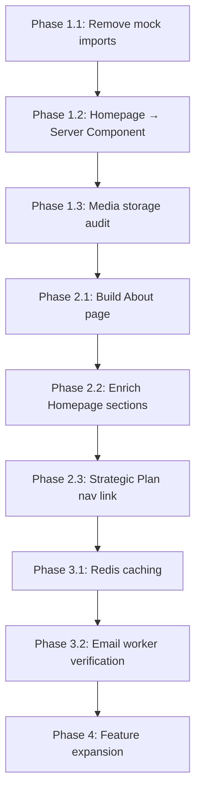

# EBIC Platform — Prioritized Action Plan

After a thorough audit of the codebase, roadmap, schema, recent git history, and conversation history, here is a prioritized action plan organized into **4 phases** from most critical to least.

---

## Current State Summary

| Area | Status | Key Findings |
|------|--------|-------------|
| **Public Pages** | ✅ Live | Home, Entrepreneurship, Incubators, Collaborators, Innovators, Contact, FAQ, Privacy, Terms |
| **Admin Dashboard** | ✅ Built | Overview, Submissions, Content, News, FAQs, Reports, Strategic Plans, Settings, Templates, Users, Notifications |
| **Registration Forms** | ✅ Stabilized | Recent fixes for wizard navigation, file uploads, race conditions (last 3 conversations) |
| **Auth/RBAC** | ✅ Solid | NextAuth + 2FA + 5-role RBAC system fully functional |
| **Email System** | ✅ Working | Nodemailer + templates + notification service |
| **Docker/Deploy** | ✅ Working | Dockerfile, docker-compose, Nginx, deploy scripts, prod running |
| **Mock Data** | ⚠️ 2 files still importing | `src/features/innovators/components/proem.tsx`, `src/components/faq.tsx` |
| **Homepage** | ⚠️ Client-only | `page.tsx` is `"use client"` — violates Server Components principle |
| **About Page** | ❌ Missing | Referenced in framework but no `/about` route exists |
| **WhatsApp** | ❌ Not started | Schema exists (`WhatsAppLog`) but no service implementation |
| **Redis Caching** | ⚠️ Partial | `cache.ts` and `redis.ts` exist with LRU fallback, but not fully leveraged |
| **Media Storage** | ⚠️ Mixed | S3/MinIO integration exists for new uploads, but legacy BLOB references may linger |

---

## Phase 1: Foundation Integrity (🔥 CRITICAL — Do First)

> Fix architectural issues that could cause production failures or data corruption.

### 1.1 Remove Mock Data Imports

**Impact:** Public pages may render stale/fake data instead of real DB content.

| File | Issue |
|------|-------|
| [proem.tsx](file:///home/glitch/Documents/Next.JS/website/src/features/innovators/components/proem.tsx) | Imports from `@/mock` |
| [faq.tsx](file:///home/glitch/Documents/Next.JS/website/src/components/faq.tsx) | Imports from `@/mock` |

**Action:** Replace mock imports with real API calls / `useQuery` hooks. Then **delete** `src/mock/index.ts` (25KB of dead weight).

> [!WARNING]
> The FAQ component may be rendering hardcoded mock FAQs instead of the `FAQ` model data already in the database.

### 1.2 Convert Homepage to Server Component

**Current:** `src/app/[locale]/page.tsx` is `"use client"` with only a `<Hero />` component — no SSR benefits.

**Action:** Make the homepage a Server Component. Only the `HomeHero` itself needs `"use client"` (it already has it). The page wrapper should be a server component that passes locale/direction props down.

### 1.3 Verify Media Storage Migration Completeness

**Current:** Schema shows `Image` and `Media` models with `url`, `s3Key`, `s3Bucket` fields (good — no BLOB). But the roadmap flagged this as "CATASTROPHIC" risk.

**Action:** Audit for any remaining BLOB paths or direct DB-stored binary data. Verify all upload flows go through `s3Service.uploadFile()`.

---

## Phase 2: Missing Content & Pages (🟡 HIGH — User-Facing Gaps)

> Fill gaps that visitors or stakeholders would immediately notice.

### 2.1 Build the "About" Page

The EBIC framework explicitly defines an `about` page with sections: `hero`, `goals`, `platform`. The `PageContent` schema supports it, but:
- No `/about` route exists in `src/app/[locale]/`
- No navigation link to "About" in `constants.ts`
- No seed data for `page: "about"`

**Actions:**
1. Add `about` to the `PageContent` model's page enum (in seed)
2. Create seed data: center goals, platform description, department overview
3. Create `src/app/[locale]/about/page.tsx` (Server Component)
4. Add "About" to navigation in `constants.ts`
5. Add AR/EN translations

### 2.2 Enhance the Homepage Beyond Hero-Only

**Current:** The homepage is literally just a `<Hero />` component — no news feed, no stats, no collaborators preview, no CTA sections.

**Proposed sections:**
1. **Hero** (existing — keep)
2. **Stats/Metrics** — Total collaborators, innovators, projects supported
3. **Latest News** — 3-4 recent news cards
4. **Featured Collaborators** — Approved partner logos/cards
5. **Call to Action** — Registration prompts for innovators + collaborators
6. **FAQ Preview** — Top 3-4 FAQs with "See all" link

### 2.3 Strategic Plan Navigation

Strategic Plans exist at `/(standalone)/StrategicPlan/[slug]` but aren't reachable from the main navigation. Consider adding a sub-item under "Entrepreneurship & Incubators" or as a standalone nav item.

---

## Phase 3: System Hardening (🔧 MEDIUM — Operational Excellence)

> Improve reliability, performance, and developer experience.

### 3.1 Redis Caching — Full Implementation

**Current:** `src/lib/cache.ts` and `src/lib/redis.ts` exist with LRU fallback. The roadmap Task 26 is "Not Started".

**Actions:**
- Apply `cache.get/set/del` to high-traffic public endpoints:
  - `GET /api/pageContent/public/:page`
  - `GET /api/news` (public listing)
  - `GET /api/faqs` (public listing)
  - `GET /api/collaborators` (public listing)
  - `GET /api/innovators` (public listing)
- Add `cache.del()` calls after every mutation on these resources

### 3.2 Email Queue Worker Verification

**Current:** `worker.ts` and `Dockerfile.worker` exist. Recent deploys fixed worker runtime issues.

**Action:** Verify the email worker actually processes the queue reliably under load. Check BullMQ dead-letter handling.

### 3.3 File Naming Convention Audit

**Current:** Mixed naming — `CardCompanies.tsx` vs `card-innovators.tsx`, `Hero.tsx` vs `home-hero.tsx`.

**Action:** Document the convention (kebab-case for files, PascalCase for exports) but **defer actual renames** to avoid breaking imports during active development.

---

## Phase 4: Feature Expansion (🟢 LOW — Nice to Have)

> New features that add value but aren't blocking launch.

### 4.1 WhatsApp Integration (Task 9)

Schema `WhatsAppLog` model exists. `src/lib/whatsapp/` directory exists. Need to:
- Choose API provider (Meta Cloud API vs Twilio)
- Implement service layer
- Integrate with registration + approval workflows

> [!IMPORTANT]
> **Decision Required:** Which WhatsApp Business API provider will you use? This is blocked until you have credentials.

### 4.2 Manager Dashboard Enhancement (Task 18)

Admin dashboard exists with submissions, content, news management. The "manager-specific" dashboard with data visualization (charts, quick-approve widgets) is a polish item.

### 4.3 Report Generation Enhancement

The `Report` model and admin reports page exist. Enhance with actual PDF/CSV generation using the `Report` infrastructure.

### 4.4 Accessibility Audit

- ARIA labels for interactive elements
- Keyboard navigation for modals and cards
- Screen reader testing for both AR/EN
- Focus indicators on all interactive elements

---

## Recommended Execution Order

## Open Questions

> [!IMPORTANT]
> 1. **About Page Content:** Do you have the actual Arabic/English content for the "About" page (center goals, platform vision, department structure)? Or should I draft placeholder content based on the EBIC framework document?

> [!IMPORTANT]
> 2. **Homepage Enrichment:** Do you want me to implement the full homepage with News + Stats + Collaborators sections, or keep it minimal for now?

> [!IMPORTANT]  
> 3. **WhatsApp Provider:** Have you decided on Twilio vs Meta Cloud API for WhatsApp Business? Do you have API credentials?

> [!IMPORTANT]
> 4. **Launch Timeline:** Is there a target launch date? This will help me prioritize Phase 2 vs Phase 3 work.

---

## Estimated Effort

| Phase | Tasks | Estimated Time |
|-------|-------|----------------|
| **Phase 1** | Mock cleanup, Homepage SSR, Media audit | 3-4 hours |
| **Phase 2** | About page, Homepage enrichment, Strategic nav | 12-16 hours |
| **Phase 3** | Redis caching, Worker verification, Naming docs | 8-10 hours |
| **Phase 4** | WhatsApp, Manager dashboard, Reports, a11y | 30-40 hours |
| **Total** | | **53-70 hours** |

---

*Plan based on codebase audit conducted 2026-05-05*
